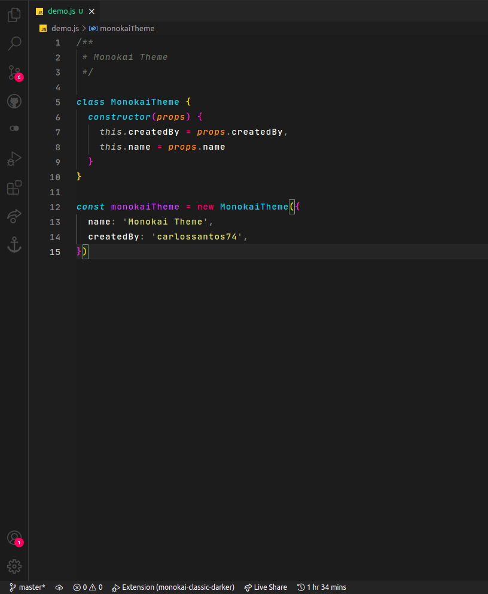

# Monokai classic for Visual Studio Code

Esquema de cores para a interface do Visual Studio Code. Baseado no monokai clássico.

<br>

### Instalação
<br>

```
1. Extensions ‣ Search for 'Monokai classic darker' ‣ Install
2. Command Palette ‣ Prefereces: Color Theme ‣ monokai-classic-darker
```
<br>
---



